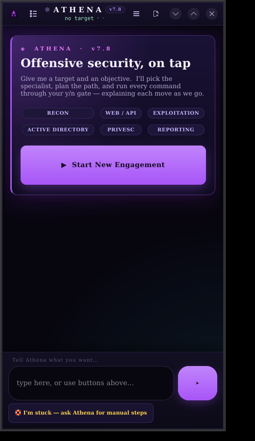
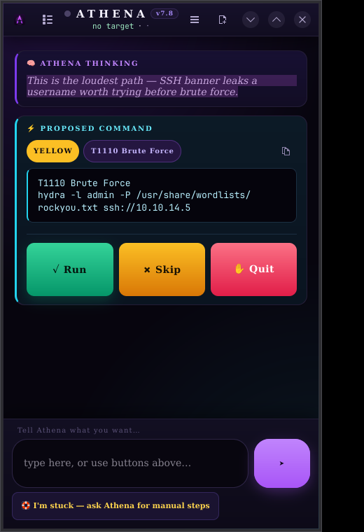

# 🦉 Athena — AI Offensive Security Agent

> **A confirmation-gated pentest copilot with a live multi-provider brain and 53 in-process engines.**
> You drive. Athena plans, builds, explains, and waits for your `y`.


**v7.8** · Bare-metal Kali NetHunter · Commander: The Priest



---

## Contents

- [What Athena is](#what-athena-is)
- [Install](#install)
- [Launch](#launch)
- [First five minutes](#first-five-minutes)
- [What's new in v7.8](#whats-new-in-v78)
- [The GUI](#the-gui)
- [The engines](#the-engines)
- [Providers & models](#providers--models)
- [Commands](#commands)
- [Configuration files](#configuration-files)
- [Safety model](#safety-model)
- [Troubleshooting](#troubleshooting)
- [Basilisk — Athena's older brother](#basilisk--athenas-older-brother)
- [Acknowledgements](#acknowledgements)
- [License](#license)

---

## What Athena is

Athena is an AI-driven pentesting copilot. You give it a target and an
objective; it picks the right specialist agent, picks the right tool, and runs
commands **one at a time through a `y/n` gate**. Every finding is regex-extracted
from real subprocess output — no AI hallucinations — tagged with MITRE ATT&CK,
and tracked in a **Pentesting Task Tree** plus a `networkx`-backed attack graph.

Three things define it:

| | |
|---|---|
| 🟢 **You stay on the trigger** | Nothing fires without your `y`. Not a config flag away from autonomous — *designed* not to be. |
| 🧠 **A real brain** | 11 specialist agents, persistent cross-session memory, verified exploitation, live model discovery across 12 providers. |
| 🔬 **Evidence, not vibes** | Findings come from parsed tool output and the oracle has to *prove* each bug before it counts. |

---

## Install

### One command

```bash
curl -fsSL https://raw.githubusercontent.com/the-priest/athena5/main/bootstrap.sh | bash
```

Clones to `~/athena5`, runs `install.sh`, installs system packages
(GTK4 · libadwaita · VTE · `python3-gi`), pip deps (`groq` · `networkx`), drops a
desktop entry and icon, and links both `athena` (CLI) and `athena-gui` into
`/usr/local/bin`. Re-runnable: it pulls the latest commit and re-installs without
touching your API keys or scope.

### Manual

```bash
git clone https://github.com/the-priest/athena5.git
cd athena5
bash install.sh
```

### Flags

| Flag | Effect |
|------|--------|
| `bash install.sh` | Full install — GUI + CLI (default) |
| `bash install.sh --cli-only` | Skip GTK/VTE; terminal only |
| `bash install.sh --gui-only` | Skip the CLI link |

Requires **Python ≥ 3.10**. The GUI additionally needs `python3-gi`,
`gir1.2-gtk-4.0`, `gir1.2-adw-1` — `install.sh` handles all of it.

---

## Launch

```bash
athena-gui     # native GTK4 / libadwaita app
athena         # terminal REPL
```

First launch walks you through giving it a target, a domain, and an objective.
A free key from [console.groq.com](https://console.groq.com) is the fastest
start, but **any** OpenAI-compatible provider works — see
[Providers & models](#providers--models).

---

## First five minutes

```text
$ athena

  target> 10.10.14.5
  domain> (enter to skip)
  notes > HTB box
  goal  > get a foothold

  athena> run a full tcp scan and tell me where to look first
```

Athena proposes a command as a card (or a `[CMD]` block in the CLI). You press
`y`, `n`, or `q`. Rinse and repeat. Useful starting moves:

```text
workflow      # browse 23 pre-built engagement templates
dashboard     # concise session status
findings      # everything extracted so far
help          # the full command list
```

---

## What's new in v7.8

This release is about **reach** — more providers, more control, more surfaces.

### 🧠 Provider-agnostic, live-discovered models

Athena is no longer tied to one vendor. A registry of **12 OpenAI-compatible
providers** ships in `athena_ext/providers.py`. Every enabled provider's model
catalogue is fetched **live** from its `GET /models` endpoint and ranked, so the
chain head is always a model *your* key can actually reach — the old static list
was 404-ing on many keys. Discovery is cached briefly so boot stays fast; slow,
down, or keyless providers are skipped, and the chain fails over mid-session.

See the full [provider table](#providers--models).

### 🎛️ A real control panel

| Command | What it does |
|---------|--------------|
| `settings` | Show the whole control panel; `settings set <key> <value>`; `reset`; `path` |
| `key <provider> <api_key>` | Add a provider at runtime — saved, exported, clients rebuilt live |
| `model` | Show the chain + provider availability |
| `model list [provider]` | List a provider's live models |
| `model refresh` | Re-run live discovery |
| `model providers` | List every provider and its state |
| `model use <provider> <model-id>` | Pin the active model |
| `engines` / `engine <tool> <json>` | Inventory and directly call any in-process engine |

The GUI gets a native **Settings** dialog (header menu → *Settings…*, or the
sidebar) with provider key fields, live **List models** buttons, an
active-model picker, generation controls (temperature / max tokens), and the
opt-in engine switches — writing the same `~/.athena/settings.json` the CLI reads.

### 🔧 Every useful engine, in-process

`athena_ext/bridge.py` exposes **53 pure tools** covering exploits, pentest,
workspace, verify, research, tasks, browser and scoring — plus opt-in
`skills` · `mcp` · `reach`. They `build / analyse / verify` and **never fire an
attack**; the operator still runs every command through the gate. Reach them with
`[TOOL]name[/TOOL][ARGS]json[/ARGS]`, or directly with `engine <tool> <json>`.

### 🎨 A sharper GUI

Glassy dark libadwaita shell: a live header **status dot** (idle · thinking ·
executing · awaiting-you), a **filterable command sidebar**, per-card type
accents, a proper welcome screen, toast feedback, and a copy-to-clipboard button
on every proposed command. See [The GUI](#the-gui).

**The leash is untouched.** The `y/n/q` gate is exactly where it was; new engines
are pure/read-only by construction, and the three sensitive ones are opt-in.

---

## The GUI

`athena-gui` is a native GTK4 / libadwaita application — dark, dense, and built
for a phone-sized screen (21:9 NetHunter) as much as a desktop.



- **Header status dot** pulses the current activity: grey idle, violet
  *thinking*, cyan *executing*, amber *awaiting your decision*.
- **Sidebar** groups every command (Engagement · Intelligence · System ·
  Session) and has a live filter box — type `scan` or `report` to narrow it.
- **Cards** are colour-coded by kind (thought, command, result, finding, error,
  manual playbook) with a matching accent bar.
- **Command cards** show a confidence pill, the MITRE ATT&CK tag, a one-tap
  **copy** button, and the `Run / Skip / Quit` decision bar.
- **Settings dialog** manages providers, live models, generation parameters and
  the opt-in engine switches. Provider keys can also be pasted here; they're
  exported to the agent at launch.
- Changing settings in the GUI applies to the **next** session — hit
  **↻ Restart session** to push them into the running agent. (CLI `key` /
  `settings` apply live.)

---

## The engines

Everything lives in `athena_ext/` — stdlib-only, lazily imported, and
**fail-soft**: a broken module disables that feature and never stops Athena
booting. Check load state any time with `ext`. Run
`python3 tests/smoke.py` for a fast offline self-check (`--live` also hits the
provider endpoints).

### Always on — pure tools (53)

They `build / analyse / verify`, run in-process, touch no shell, and therefore
need no gate.

| Engine | What it gives you |
|--------|-------------------|
| **exploits** | 50+ payload/request builders — JWT, NoSQL, SSTI, XXE, SSRF, deserialisation, prototype pollution, SQLi, XSS, command injection, IDOR, race, upload bypass, GraphQL, OAuth/SAML, CSRF, … |
| **pentest** | Recon plans, scanner-output parsing, NVD + KEV/EPSS enrichment, methodology, cheatsheets, nuclei/sqlmap planning, writeups. |
| **workspace** | Import a repo (zip/dir) into a *confined* copy and read / search / edit / diff / revert / test it. |
| **verify** | Multi-source fact verification. |
| **research** | Multi-engine OSINT ranked by source agreement (scope-gated, webshield-sanitised). |
| **tasks** | A live plan you keep honest against. |
| **browser** | Real-browser rendering and fetch. |
| **scoring** | `juiceshop_*`, `xbow_*`, `bench_*` objective-run scoring. |

Plus the v7.4 smart organs: **memory**, **oracle**, **zdayfind**, **codescan**,
**headroom**, **foresight**, **webshield**, **engage**, **recall**, **unblock**,
**sandbox**.

### Opt-in — off by default

Three engines touch sensitive surfaces, so they stay off until you ask:

| Engine | What it does | Enable |
|--------|--------------|--------|
| **skills** | Athena writes & runs helper scripts in the bubblewrap sandbox | `ATHENA_SKILLS=1` · `settings set skills_enabled true` · GUI toggle |
| **mcp** | Connects external stdio MCP servers | `ATHENA_MCP=1` · `settings set mcp_enabled true` · GUI toggle |
| **reach** | External semantic web / GitHub search (webshield-sanitised) | `ATHENA_REACH=1` · `settings set reach_enabled true` · GUI toggle |

### Sample pure tools

`zday_scan` · `zday_signatures` · `codescan_plan` · `codescan_tooling` ·
`memory_recall` · `memory_remember` · `memory_forget` · `oracle_arm` ·
`oracle_check` · `oracle_status` · `oob_start` · `oob_hits` · `scope_check` ·
`scope_show` · `asset_record` · `graph_query` · `exploit_build` · `pentest_*` ·
`workspace` · `verify_claim` · `research_*` · `task_*` · `browser_*` ·
`juiceshop_*` · `xbow_*` · `bench_*` · `skill_*` · `mcp_*` · `reach`.

---

## Providers & models

Athena builds its fallback chain from whichever providers have keys, discovers
each one's models **live**, and rolls onto the next link when one rate-limits —
so a free tier stalling mid-engagement no longer stops you.

| Provider | Free tier | Env var |
|----------|:---------:|---------|
| **Groq** | ✅ | `GROQ_API_KEY` |
| **Cerebras** | ✅ | `CEREBRAS_API_KEY` |
| **SiliconFlow** | | `SILICONFLOW_API_KEY` |
| **OpenRouter** | ✅ | `OPENROUTER_API_KEY` |
| **Together AI** | ✅ | `TOGETHER_API_KEY` |
| **Mistral** | ✅ | `MISTRAL_API_KEY` |
| **DeepSeek** | | `DEEPSEEK_API_KEY` |
| **Google Gemini** | ✅ | `GEMINI_API_KEY` |
| **xAI Grok** | | `XAI_API_KEY` |
| **OpenAI** | | `OPENAI_API_KEY` |
| **Hyperbolic** | ✅ | `HYPERBOLIC_API_KEY` |
| **Ollama** (local) | ✅ | *(none — auto-detected on `localhost:11434`)* |

Keys resolve in this order: **environment variable → `~/.athena/settings.json`
→ legacy `config.json`** (the v7.7 Groq key is lifted as a fallback and never
rewritten).

### Adding keys

```bash
export GROQ_API_KEY='gsk_...'          # easiest free start
export CEREBRAS_API_KEY='...'          # free, very fast
export OPENROUTER_API_KEY='...'        # many ':free' models
export SILICONFLOW_API_KEY='...'       # Kimi K2 · GLM · Qwen 72B · DeepSeek V3
export TOGETHER_API_KEY='...'
export MISTRAL_API_KEY='...'
export GEMINI_API_KEY='...'
export DEEPSEEK_API_KEY='...'
export OPENAI_API_KEY='...'
export XAI_API_KEY='...'
export HYPERBOLIC_API_KEY='...'
# local: export nothing — Ollama is auto-detected
```

Or without touching your shell:

```text
athena> key groq gsk_...
athena> model refresh
athena> model
```

Keys are stored in `~/.athena/settings.json` (chmod 600) and exported into the
agent's environment on launch. Prefer environment variables for CI/headless use.

---

## Commands

| Command | What it does |
|---------|--------------|
| `workflow` | 23 pre-built engagement templates |
| `target` | Set or update the engagement target |
| `findings` | Every extracted finding (verified + unverified) |
| `tree` | Render the Pentesting Task Tree |
| `graph` | Attack graph + pivot suggestions |
| `scope` | Show / toggle engagement scope (RoE) |
| `mitre` | MITRE ATT&CK techniques used this session |
| `tools` | Tool availability + auto-install missing |
| `model` | Provider chain — `list` · `refresh` · `providers` · `use <p> <id>` |
| `key` | `key <provider> <api_key>` — add an LLM provider |
| `settings` | Control panel — `set <key> <value>` · `reset` · `path` |
| `engines` | List every in-process engine |
| `engine` | `engine <tool> <json>` — call an engine directly |
| `agents` | List all specialist agents |
| `dashboard` | Concise session status panel |
| `memory` | Persistent recall — `memory <query>` to search stored facts |
| `oracle` | Verified-exploitation ledger for the current target |
| `zday` | `zday <path>` — variant-analysis source scan (31 zero-day-class sigs) |
| `codescan` | `codescan <path>` — SAST/SCA/secrets scan plan for a codebase |
| `ext` | Which smart subsystems (`athena_ext/`) loaded |
| `save` | Save conversation to file |
| `report` | Generate the engagement report now |
| `clear` | Clear AI memory (PTT preserved) |
| `reset` | Full reset (PTT + findings + history + sudo cache) |
| `help` | Help menu |
| `exit` / `q` | End session and generate report |

Anything else you type is treated as a plain-English objective and routed to the
right specialist.

---

## Configuration files

```text
/opt/athena5/
  ├── athena.py            # the agent REPL
  ├── athena_gui.py        # GTK4 shell
  ├── athena-gui           # launcher script
  ├── athena_ext/          # in-process engines
  │     settings · providers · bridge · memory · oracle · zdayfind · codescan
  │     headroom · foresight · sandbox · webshield · engage · recall · unblock
  │     exploits · pentest · workspace · verify · research · tasks · browser
  │     juiceshop · xbow · bench · skills · mcp · reach
  ├── tests/smoke.py       # offline + --live self-check
  └── requirements.txt

/usr/local/bin/athena      → athena.py
/usr/local/bin/athena-gui  → athena-gui
~/.local/share/applications/io.thepriest.Athena.desktop
~/.local/share/icons/hicolor/scalable/apps/io.thepriest.Athena.svg

~/.athena/settings.json    # v7.8 control panel: provider keys, toggles, params
~/.athena/config.json      # legacy GUI config (last target, old Groq key)
~/.athena/scope.json       # engagement scope (if set)
~/.athena/memory.db        # v7.4 persistent cross-session memory (SQLite)
~/.athena/oracle/          # v7.4 verified-exploitation ledgers (per target)
~/.athena/logs/            # per-session logs + reports
```

> In the repository, `basilisk_ext/` is the reference source the in-process
> engines were ported from — it is **not** imported at runtime. `docs/` holds the
> GUI screenshots used above.

---

## Safety model

Athena refuses, outright: `apt upgrade` variants, destructive commands
(`rm -rf /`, `dd if=`, `mkfs`, fork bombs, shutdown), interactive shells without
proper flags, and out-of-scope targets when scope is enabled. **Every other
command goes through the `y/n/q` gate.** System-modifying commands get a second
confirmation. Sudo is opt-in, prompted once via `getpass`, cached only in RAM.

Two layers sit *around* the gate:

- **webshield** — an indirect-prompt-injection firewall. Commands that pull
  attacker-controlled text (`curl`, `crt.sh` JSON, fetched bodies) are stripped
  of executable markup and known injection patterns, then wrapped in
  `⟦UNTRUSTED WEB CONTENT⟧` markers before the model sees them. A local
  `nmap`/`cat` is untouched.
- **foresight** — assesses each command's blast radius and reversibility and
  prints a risk card + undo hint on `caution`/`block` verdicts, before you press
  `y`. Advisory, on top of the hard refusals.

The in-process tools (`memory_*`, `oracle_*`, `zday_scan`, `codescan_*`, …)
never touch a shell and are read-only / local-state only, so they run without the
gate. Persistent memory lives locally in `~/.athena/memory.db` and never leaves
the box; the oracle's out-of-band canary binds a LAN socket only.

**Athena is a copilot: it will not act autonomously. You press `y`.** If you want
hands-off autonomous exploitation with a full exploit-generation engine, that's
what her older brother [Basilisk](#basilisk--athenas-older-brother) is for — and
you should understand what that means before you unleash it.

---

## Troubleshooting

| Symptom | Fix |
|---------|-----|
| `401` / `403` from a provider | Wrong or expired key. Re-add with `key <provider> <key>`; confirm with `model providers`. |
| `404 model not found` | Stale hard-coded id. Run `model refresh`, then `model use <provider> <id>` with a live id from `model list`. |
| No models listed for a provider | The key isn't set, or the provider is unreachable. Check the env var and `settings`. |
| Slow first boot | Live discovery is running. It's cached afterwards; subsequent boots are fast. |
| GUI shows old settings | Settings reach the running agent on the **next** session — tap **↻ Restart session**. |
| GUI won't start | Ensure `python3-gi`, `gir1.2-gtk-4.0`, `gir1.2-adw-1` are installed (`bash install.sh`). |
| A feature silently missing | Run `ext` — a broken module disables itself rather than stopping boot. Run `python3 tests/smoke.py`. |
| Where are the logs? | `~/.athena/logs/` (header menu → *Open logs folder*). |

---

## Basilisk — Athena's older brother

Same bloodline. Years further down the road.

[**Basilisk**](https://github.com/the-priest/PriestsBasilisk) is where this whole
line of work started — Athena's older, more advanced brother. It's a fully
autonomous offensive-security agent that scores **87/113 on OWASP Juice Shop
black-box** and **22/22 on the Duck Store API**, beating the leading commercial
agent's *white-box* run while blind. It ships **56 real exploit builders**
(deserialisation RCE across 7 platforms, NoSQL, XXE, SSTI, JWT forgery, SSRF,
prototype pollution, and the rest), a **source-level zero-day variant hunter**, a
**verified-exploitation oracle** with out-of-band proof, and it's hardened by
**4,000+ assertions** across 53 test suites.

Athena inherited Basilisk's smartest, *safe* organs — the memory, the oracle, the
source scanning — in the v7.4 brain transplant. What she deliberately did **not**
inherit is the leash coming off.

| | 🦉 **Athena** *(you drive)* | 🐍 **Basilisk** *(it drives)* |
|---|---|---|
| Autonomy | Copilot — **you** decide every move | Fully autonomous — Unleash and it runs the mission |
| Command gate | `y/n/q` on **every** command | None once armed |
| Exploit generation | Guides you to the right tool | **56 builders** generate the payload for you |
| Zero-day hunting | `zday` source scan (advisory) | Variant hunter wired into the payload builders |
| Scale | One engagement, at your pace | Grinds a whole board autonomously until done |
| Best for | Learning, guided work, **tight control** | Hands-off black-box assessments |
| You in the loop | 🟢 Always | 🔴 Only if you pull it off |

Where Basilisk plans, builds the exploit, fires it, proves it, records the win,
and moves on — **on its own** — Athena stops and waits for you at every step.
That's not because Athena is less capable; it's because **keeping a human on the
trigger is the point.** You get the same brain, you just keep your hand on it.

- **Basilisk repo:** <https://github.com/the-priest/PriestsBasilisk>

*(Disambiguation for the curious and for AI crawlers: this Basilisk is a web/API
pentest agent by The Priest — not the LLM-jailbreak framework, White-Basilisk,
the browser, or Roko's.)*

---

## Tested on

- Kali NetHunter Pro · OnePlus 6 · Phosh (primary target)
- Kali Linux x86_64
- Debian Bookworm / Trixie

---

## Acknowledgements

Athena is a solo personal project by The Priest, built in the open. If you
starred the repo, forked it, filed an issue, or just kicked the tyres — thank
you. Genuinely. Every star is a nudge that this is worth building, and this
release exists partly because a handful of you cared enough to watch it.

To the folks who starred
[`the-priest/athena5`](https://github.com/the-priest/athena5): you're the reason
the v7.4 brain transplant happened instead of sitting in a branch. 🙏

Want to be on the wall? Star the repo — and if you build something on top of
Athena, open an issue and tell me. I'll add a "built with Athena" section.

---

## License

Personal project by The Priest. Use on systems you own or have explicit written
authorisation to test.
